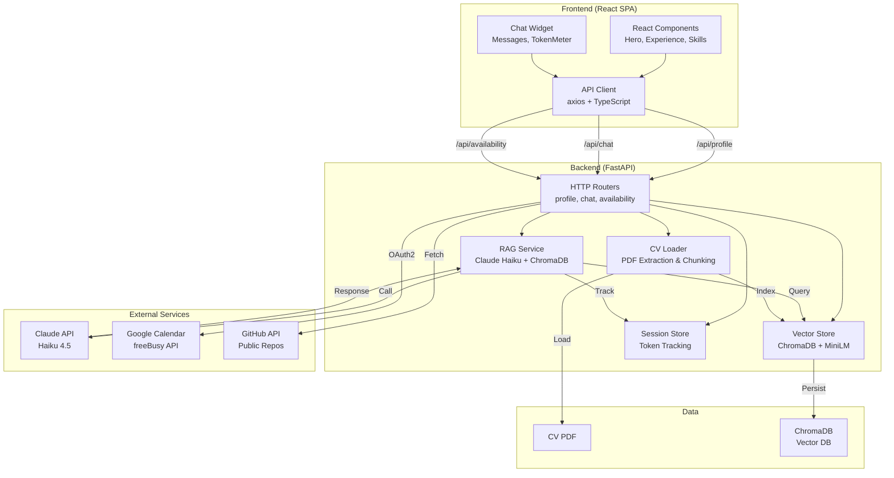
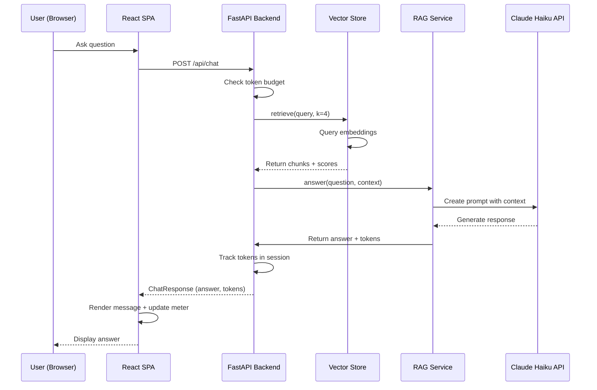

# Architecture Overview

## System Diagram



## Data Flow: Chat Request



## Component Architecture

### Backend Components

**FastAPI Application**
- CORS middleware for frontend communication
- Rate limiting (20 req/min per IP)
- Service injection via app.state

**Services**
- `CVLoader`: PDF extraction, section-aware chunking
- `VectorStore`: ChromaDB persistence with MiniLM embeddings
- `RAGService`: Query context retrieval, Claude integration, scope enforcement
- `SessionStore`: In-memory session management, token tracking
- `GitHubService`: Public repo fetching with caching
- `CalendarService`: Google Calendar OAuth2 and availability

**Routers**
- `/api/profile`: User information
- `/api/experience`: Work experience (static data)
- `/api/skills`: Skills by category
- `/api/chat`: RAG chatbot endpoint
- `/api/availability`: Free time slots
- `/api/photo`: Profile photo (JPEG)
- `/health`: Health check

### Frontend Components

**Layout Components**
- `Hero`: Profile section with photo and links
- `Experience`: Timeline of work history
- `Skills`: Grid of skills by category
- `Navigation`: Sticky header with navigation

**Chat Components**
- `ChatWidget`: Floating launcher and window
- `MessageList`: Auto-scrolling conversation thread
- `InputBox`: Text input with suggestions
- `TokenMeter`: Visual budget tracking

**Utilities**
- `APIClient`: Typed HTTP client with session management
- Types: TypeScript interfaces for type safety

## Technology Stack

**Frontend**
- React 18 with TypeScript
- Vite for bundling
- Tailwind CSS for styling
- Axios for HTTP requests
- Lucide React for icons

**Backend**
- FastAPI for async HTTP API
- Langchain for LLM orchestration
- ChromaDB for vector storage
- sentence-transformers for local embeddings
- Anthropic SDK for Claude API

**External**
- Claude Haiku 4.5 (LLM)
- Google Calendar API (availability)
- GitHub API (repos)

## Deployment Architecture

```
┌─────────────────────────────────────┐
│  Vercel (Frontend)                  │
│  ├─ React SPA (Static)              │
│  ├─ CDN Distribution                │
│  └─ Automatic CI/CD                 │
└────────────┬────────────────────────┘
             │ HTTPS API calls
             ▼
┌─────────────────────────────────────┐
│  Railway/Fly (Backend)              │
│  ├─ FastAPI Service                 │
│  ├─ ChromaDB (Persistent)           │
│  ├─ Environment Variables           │
│  └─ Auto-scaling                    │
└─────────────────────────────────────┘
```

## Security & Privacy

- **No Auth Required**: Public portfolio, read-only endpoints
- **Rate Limiting**: 20 requests/minute per IP
- **Scope Enforcement**: Chatbot restricted to CV/LinkedIn/Calendar topics
- **Token Limiting**: 8000 tokens per session to prevent abuse
- **Calendar Privacy**: Only freeBusy data exposed, no event details
- **Secrets**: API keys stored in environment variables (never in code)
- **CORS**: Configured for Vercel domain only

## Performance Characteristics

- **Embedding Model**: MiniLM-L6-v2 (~80MB, local, ~50ms latency)
- **Vector Search**: ChromaDB in-memory + disk (sub-100ms for k=4)
- **LLM Response**: Claude Haiku (~1-2 seconds for typical queries)
- **Session Storage**: In-memory (suitable for single-user portfolio)
- **Cache Lifetimes**: 1 hour for GitHub repos, 60 min session TTL
